## API LIVRARIA

Essa API foi desenvolvida em Node Js com Express, trata-se de uma API que simula o sistema de uma livraria, onde pode-se cadastrar 
livros que possuem um autor que o escreveu

# OBS: 

Ao baixar o projeto, você deve atualizar a conexão com o Banco de Dados, colocando os dados do banco de dados que você quer 
se conectar. Nessa API em sua produção, foi utilizada a versão Atlas do Mongo DB. No arquivo dbConnect.js, é onde é colocada 
a conexão com o banco. Ao acessar o site do Mongo DB e criar uma conta, vá até "Build a Database", atualiza o nome do Cluster 
caso queira, clique em "Browse Connections", "Add my Owl Data", e dê um nome para o database e sua coleção. Para fazer a conexão 
instale o MOONGOSE em seu projeto: 
                                npm i mongoose@versaoDesejada
agora clique em "connect", "connect your application", e pegue o link retornado, colocando entre aspas no arquivo dbConnect.js
                                moongose.connect("string de conexão")
mudando o nome do perfil cadastrado e a senha para o perfil que você cadastrou em seu banco. Para rodar o projeto, digite: 
                                                    npm run dev 
                                                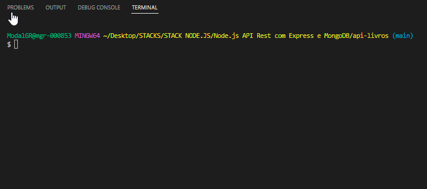
que é um script configurado para iniciar a compilação do projeto no package.json.  

# LIVROS 

### POST 
Aqui podemos cadastrar um novo livro 
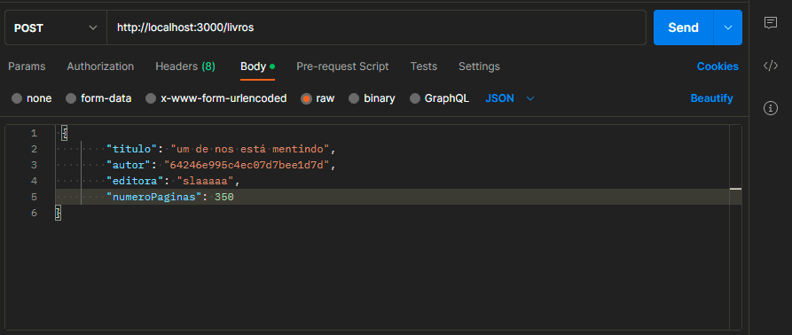

### GET
Buscar pela lista de livros cadastrados
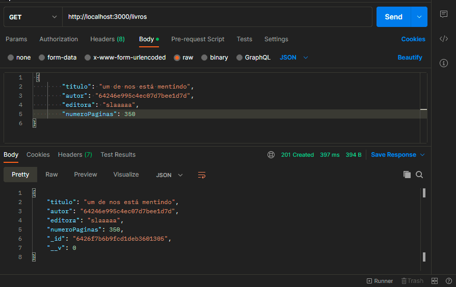

### GET ID  
Buscar um livro por id
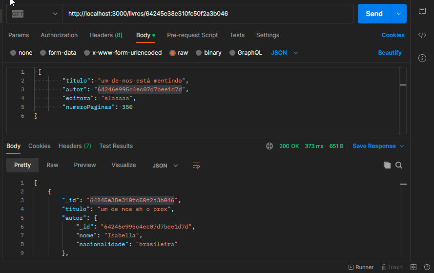

### PUT 
Atualizar livro por id

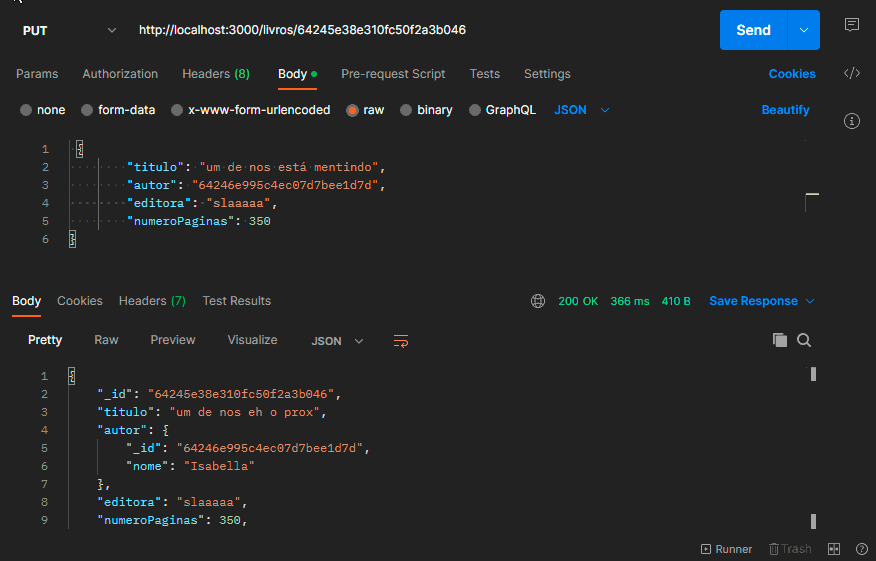

### DELETE 
Deletar livro por id

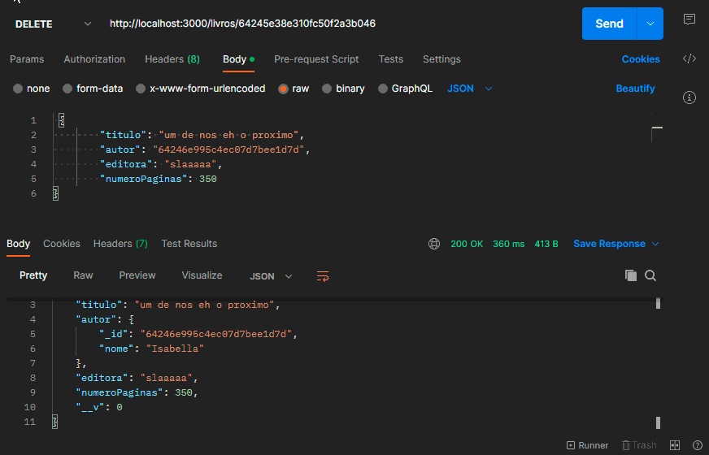

# AUTORES 

### POST 
Aqui podemos cadastrar um novo autor
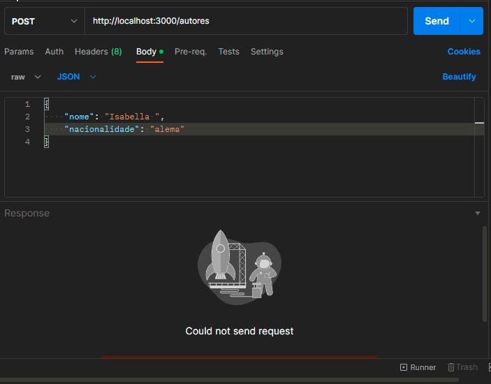

### GET
Buscar pela lista de autores cadastrados
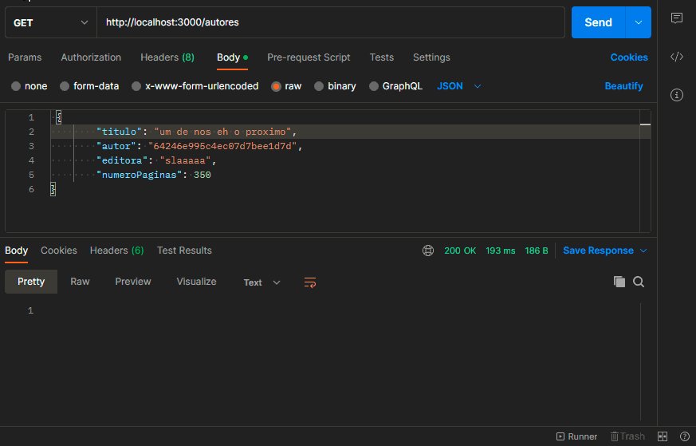

### GET ID  
Buscar um autor por id
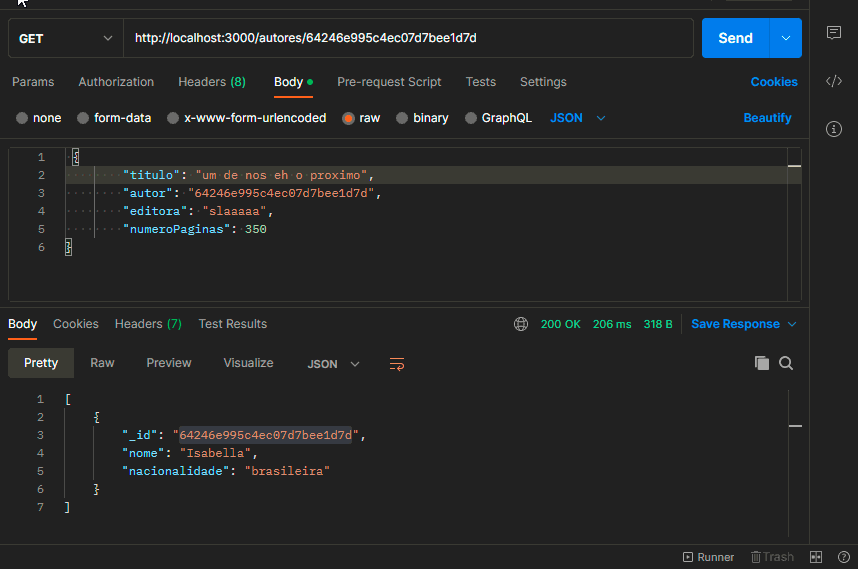

### PUT 
Atualizar autor por id
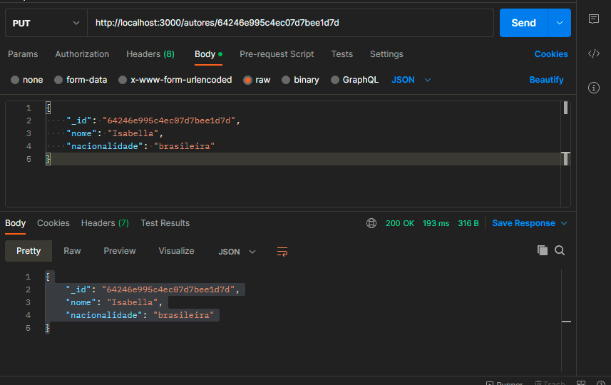

### DELETE 
Deletar autor por id
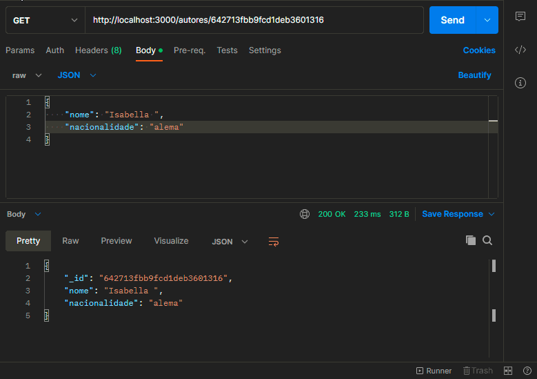

# RELACOES 

### 1:1 
Um livro possui um autor relacionado a ele. 
Pode-se referenciar o autor através do ID no cadastro de livros. 

